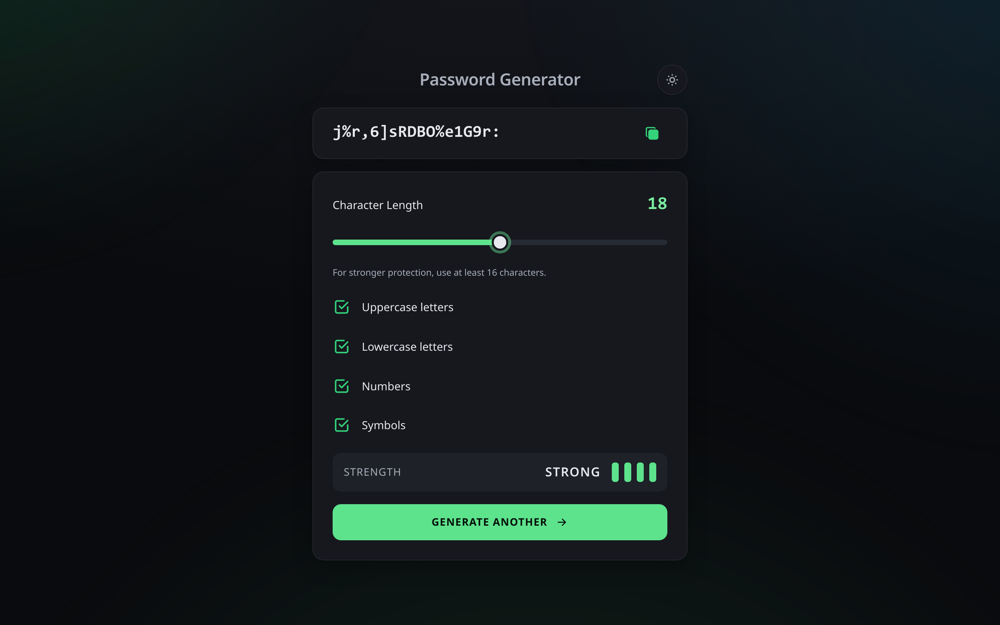
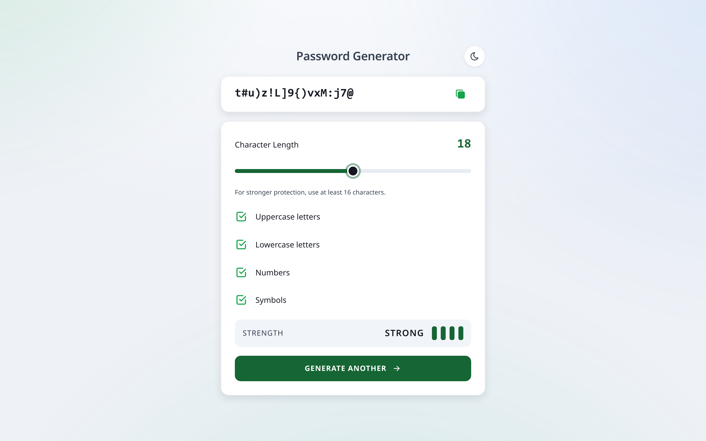
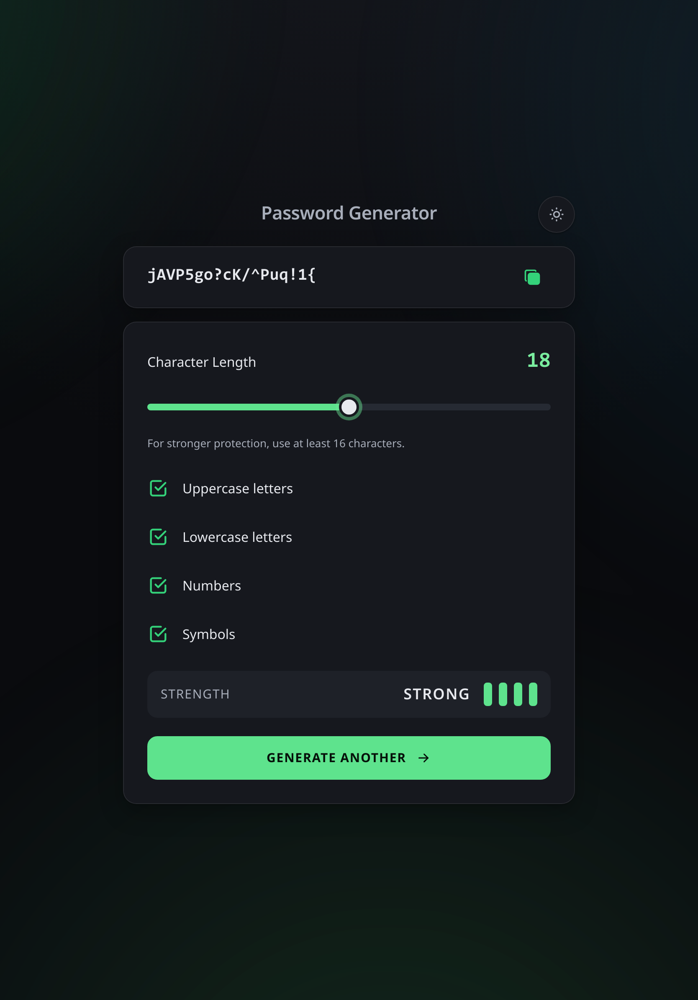
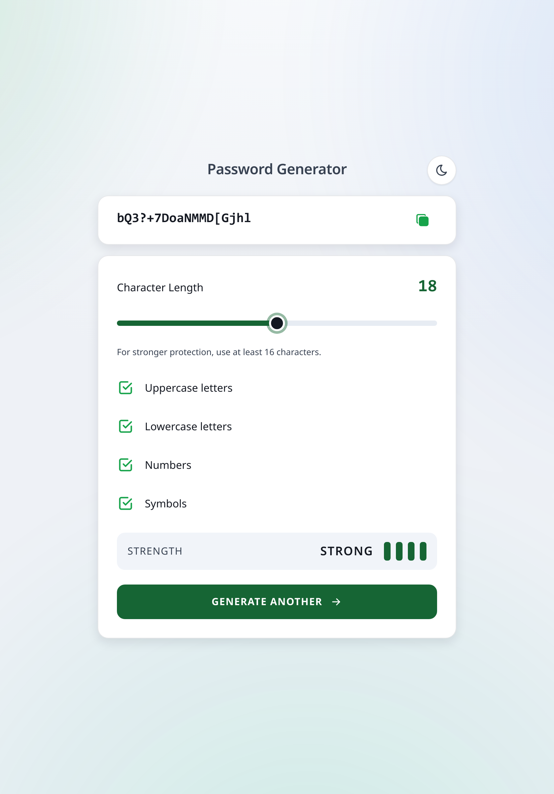
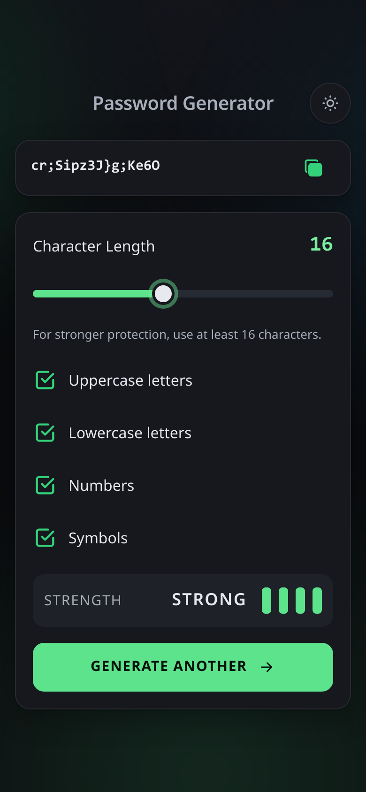
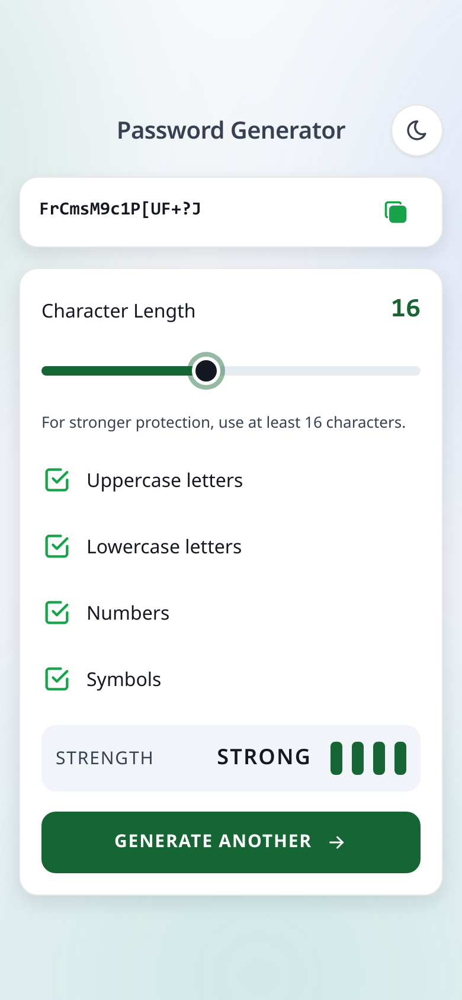

# 🔐 Password Generator — Classic

A polished, accessibility-first password generator built with semantic HTML, layered CSS and vanilla JavaScript. It runs entirely in the browser, uses the Web Crypto API for secure randomness, and stays intentionally small enough to be a strong public GitHub portfolio project.

<p align="center">
  
  
</p>
<p align="center">
  
  
</p>
<p align="center">
  
  
</p>

---

## Overview

This version is the clean, classic visual direction of the project. The repository is organized for maintainability, public review, and day-to-day editing — without enterprise-only layers or generated artifacts that add noise.

## Features

- Cryptographically secure password generation via `crypto.getRandomValues`
- Adjustable length and character set controls
- Accessible strength meter and live feedback
- Copy-to-clipboard with graceful fallback
- Dark and light themes
- Installable PWA with offline support
- Responsive screenshots in `docs/screenshots`

## Technologies

- HTML5
- Modern CSS with cascade layers and custom properties
- Vanilla JavaScript
- Playwright tests
- ESLint + Prettier + EditorConfig
- Vercel deployment config

## Folder Structure

```text
password-generator-classic/
├── .github/workflows/        # CI validation workflow
├── css/
│   ├── base/                 # Reset, tokens, typography, document primitives
│   ├── components/           # Reusable UI pieces
│   ├── layout/               # Page-level layout rules
│   ├── utilities/            # Helpers, animations, responsive overrides
│   └── styles.css            # Single source-of-truth stylesheet entry
├── docs/
│   ├── architecture.md       # Architecture rationale and folder decisions
│   └── screenshots/          # README + manifest preview assets
├── images/                   # Favicons, social image, UI icons, PWA icons
├── js/                       # Ordered browser scripts by responsibility
├── scripts/                  # Useful local maintenance scripts only
├── tests/                    # Automated project, unit, e2e and browser checks
├── 404.html
├── index.html
├── manifest.webmanifest
├── robots.txt
├── sitemap.xml
├── sw.js
├── vercel.json
├── eslint.config.mjs
├── package.json
└── README.md
```

## Installation

```bash
npm install
```

## Usage

```bash
python3 -m http.server 8000
# open http://localhost:8000
```

You can also open `index.html` directly for quick local review.

## Development

- Edit styles through `css/styles.css` and its imported partials
- Edit behaviour through the ordered files in `js/`
- Update canonical/social URLs with:

```bash
npm run set:url -- https://your-domain.example
```

## Build

No build step is required.

This repository intentionally ships source files only. That keeps the project easy to review, easy to debug, and free from duplicated generated bundles.

## Quality Checks

```bash
npm run validate
```

Extra commands:

```bash
npm run lint
npm run format:check
npm run screenshots
```

## Deployment

The repository includes **only** the Vercel configuration because that is the single committed deployment target for this portfolio version.

Other static hosts can still serve the app because all runtime asset paths are relative, but they do not need committed platform-specific config files here.

## Performance

- No framework runtime
- No generated bundle duplication in the repository
- Static assets only
- Local-first password generation
- Service worker precache for the app shell

## Accessibility

- Semantic landmarks and labels
- Keyboard support
- Screen-reader friendly status announcements
- Visible focus states
- Reduced-motion support
- Touch targets sized for mobile usability

## Documentation

- `docs/architecture.md` explains why each important folder/config exists
- `docs/screenshots/` stores curated preview assets for README and manifest usage

## License

MIT

## Credits

- UI icons derived from Tabler Icons (MIT)
- Project by DanyaL NaDeri
